<div align="center">

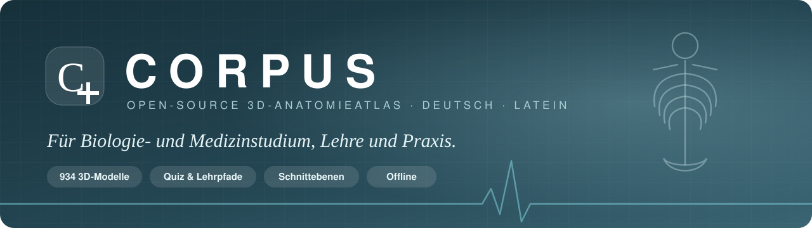

```text
 ██████╗  ██████╗  ██████╗  ██████╗  ██╗   ██╗ ███████╗
██╔════╝ ██╔═══██╗ ██╔══██╗ ██╔══██╗ ██║   ██║ ██╔════╝
██║      ██║   ██║ ██████╔╝ ██████╔╝ ██║   ██║ ███████╗
██║      ██║   ██║ ██╔══██╗ ██╔═══╝  ██║   ██║ ╚════██║
╚██████╗ ╚██████╔╝ ██║  ██║ ██║      ╚██████╔╝ ███████║
 ╚═════╝  ╚═════╝  ╚═╝  ╚═╝ ╚═╝       ╚═════╝  ╚══════╝
   A N A T O M I E A T L A S  ·  3 D  ·  O P E N   S O U R C E
```

**Der interaktive 3D-Anatomieatlas auf Deutsch & Latein – für Studium, Lehre und Praxis.**<br>
Läuft komplett im Browser. Keine Installation, kein Konto, kein Tracking.


<br>


[**Funktionen**](#-funktionen) · [**Screenshots**](#-screenshots) · [**Schnellstart**](#-schnellstart) · [**Hosting**](#-veröffentlichen) · [**Mitmachen**](#-mitmachen) · [**Lizenz**](#-lizenz)

</div>

---

## 💡 Warum CORPUS?

> In letzter Zeit haben viele eine 3D-Anatomie-Anwendung wie diese nachgebaut.
> Ich wollte ebenfalls eine eigene besitzen – **aber mit deutlich mehr Funktionen.**

Darum ist CORPUS mehr als ein drehbares Modell. Es ist ein **Lern- und Lehrwerkzeug**:

- **Schnittebenen** wie im CT
- **Abstandsmessung** in Zentimetern
- **geführte Lehrpfade** durch Kreislauf, Verdauung und Gehirn
- ein **Quiz mit Lernstand**, auf Deutsch oder Latein
- eigene **Notizen** zu jeder Struktur
- **Links**, die eine komplette Ansicht für die Vorlesung festhalten

Alles ist Open Source, statisch und datensparsam. Notizen und Lernstand bleiben auf deinem Gerät.

<table>
<tr>
<td align="center" width="25%">🎓<br><b>Studierende</b><br><sub>Quiz mit Wiederholungslogik, Latein-Modus, Notizen, Export</sub></td>
<td align="center" width="25%">👩‍🏫<br><b>Lehrende</b><br><sub>Lehrpfade, Ansicht-Links für Folien und Vorlesung, Bildexport</sub></td>
<td align="center" width="25%">🩺<br><b>Praxis & Pflege</b><br><sub>Strukturen zeigen und erklären, Schnittebenen, Messen</sub></td>
<td align="center" width="25%">🧬<br><b>Biologie</b><br><sub>13 Körpersysteme, Organfunktionen, Quellen je Eintrag</sub></td>
</tr>
</table>

---

## ✨ Funktionen

### 🔬 Werkzeuge für Studium & Lehre

| | Funktion | Beschreibung |
|---|---|---|
| ✂️ | **Schnittebenen** | Quer- (axial), Längs- (sagittal) und Frontalschnitt (koronal) mit Schieberegler, Anzeige der Schnitthöhe in cm, Seite umkehrbar. Klicks treffen nur sichtbare Geometrie. |
| 📏 | **Abstand messen** | Zwei Punkte auf einer Oberfläche antippen → Luftlinie in Zentimetern, maßstabsgetreu zum Referenzmodell. |
| 🧭 | **Lehrpfade** | 8 geführte Touren mit Erklärtext je Station: *Weg der Nahrung, Weg der Atemluft, Weg des Blutes, Weg des Urins, Rotatorenmanschette, Gehirn & Hirnstamm, Bein & Knie, Frau & Mann – was ist anders?* |
| 🎯 | **Quiz – Benennen** | Eine Struktur wird markiert, du wählst aus vier Antworten. Die Falschantworten kommen möglichst aus demselben Körpersystem. |
| 🔎 | **Quiz – Finden** | Der Name wird vorgegeben, du tippst die Struktur im 3D-Modell an. Durchsichtige Schichten werden dabei durchschaut. |
| 🏛️ | **Latein-Modus** | Das Quiz wahlweise mit deutschen Namen oder lateinischer Fachsprache. |
| 📈 | **Lernstand (Leitner)** | Falsch beantwortete Strukturen kommen häufiger, gemeisterte seltener. Fortschritt pro Struktur sichtbar. |
| 📝 | **Notizen** | Eigene Merksätze und Klinikbezug zu jeder Struktur. Werden automatisch gespeichert, lassen sich als JSON exportieren und importieren. |
| 🔗 | **Ansicht als Link** | Speichert Kamera, eingeblendete Systeme, Transparenz und Schnittebene in einem Link – ideal für Vorlesungsfolien. |

### 🫀 Entdecken

- 934 einzeln anklickbare Teilmodelle aus **BodyParts3D**, 13 Körpersysteme mit Schaltern
- Deutsche **und** lateinische Bezeichnungen für alle 934 Modelle, Suche auf Deutsch, Latein oder Englisch
- Halbseitiger Einblick, „Umgebung transparent“, Isolieren, Fokussieren (verdeckte Organe werden automatisch freigestellt)
- Vorder-, Rück- und Seitenansicht, Zoom, automatisches Drehen
- **Anatomie entfalten**: alle Teile stufenlos auseinanderziehen, nach System gruppiert

### 📤 Teilen & Mitnehmen

- Direktlink auf jede Struktur (`…/#FMA7197` → Leber), Teilen-Knopf
- **Bild speichern** als PNG mit Strukturname und Quellenangabe
- **Offline speichern** und als Web-App auf dem Home-Bildschirm installieren
- „Erste Hilfe“-Fenster mit 112 / 116117 und den wichtigsten Warnzeichen

### ⌨️ Tastenkürzel

| Taste | Aktion | Taste | Aktion |
|:---:|---|:---:|---|
| <kbd>/</kbd> | Suche | <kbd>Q</kbd> | Quiz starten/beenden |
| <kbd>F</kbd> | Fokussieren | <kbd>M</kbd> | Messen an/aus |
| <kbd>I</kbd> | Isolieren | <kbd>B</kbd> | Bild speichern |
| <kbd>X</kbd> | Umgebung transparent | <kbd>R</kbd> | Zurücksetzen |
| <kbd>1</kbd> <kbd>2</kbd> <kbd>3</kbd> | Vorder-, Rück-, Seitenansicht | <kbd>Esc</kbd> | Quiz/Lehrpfad beenden |

---

## 📸 Screenshots

<table>
<tr>
<td width="50%">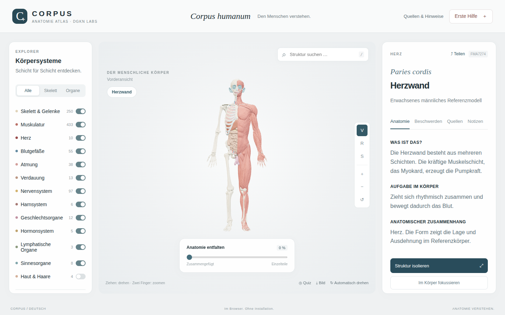<br><sub><b>Übersicht</b> – Körpersysteme, halbseitiger Einblick, Detailinformationen</sub></td>
<td width="50%">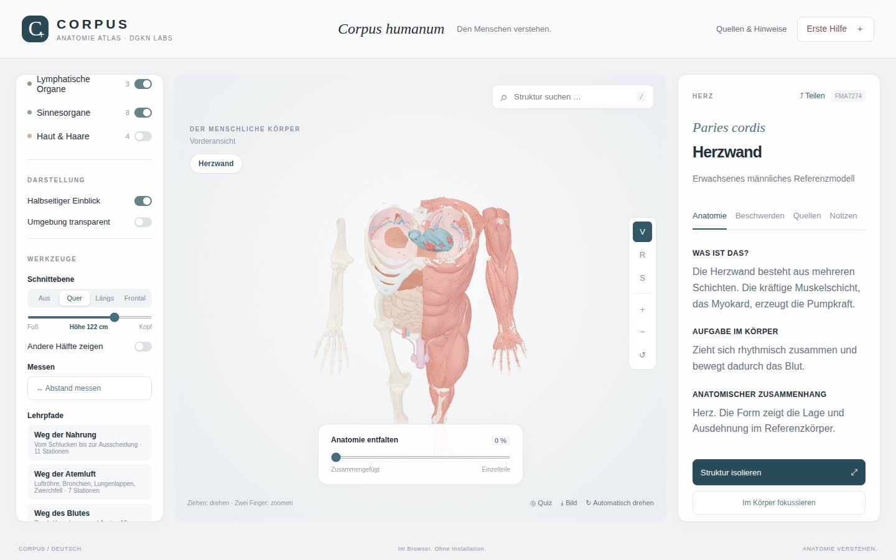<br><sub><b>Querschnitt</b> – Blick in den Brustkorb mit Herz und Lunge</sub></td>
</tr>
<tr>
<td>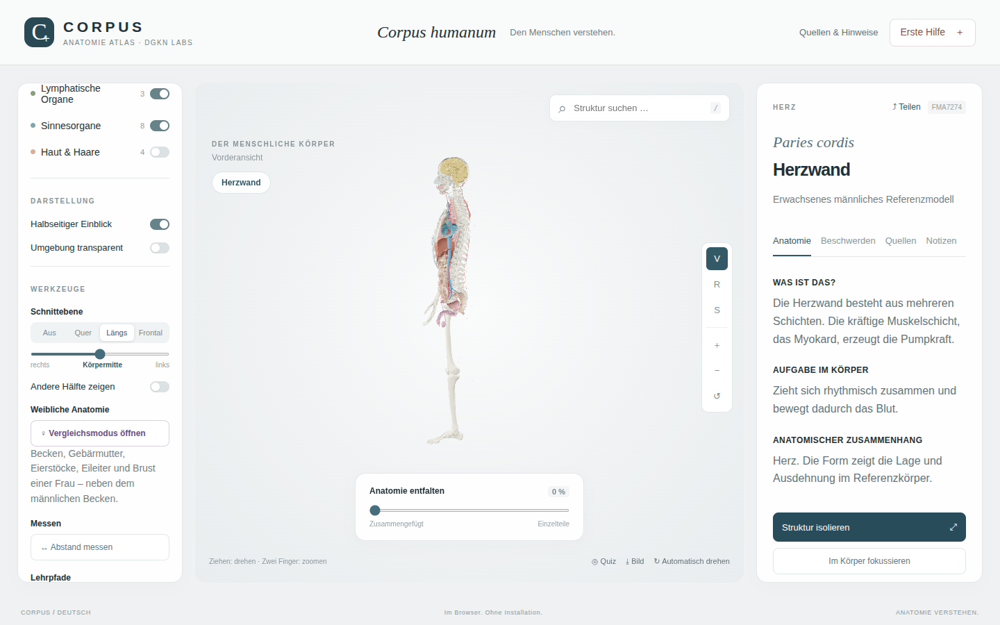<br><sub><b>Längsschnitt</b> – Organe in der Seitenansicht</sub></td>
<td>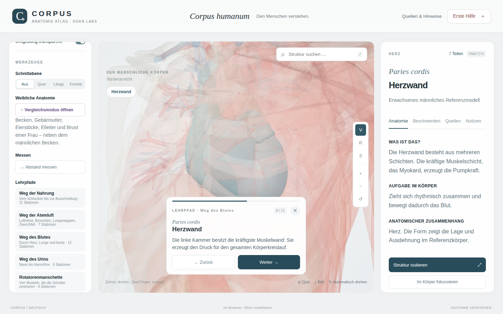<br><sub><b>Lehrpfad „Weg des Blutes“</b> – Station 8 von 12: Herzwand</sub></td>
</tr>
<tr>
<td>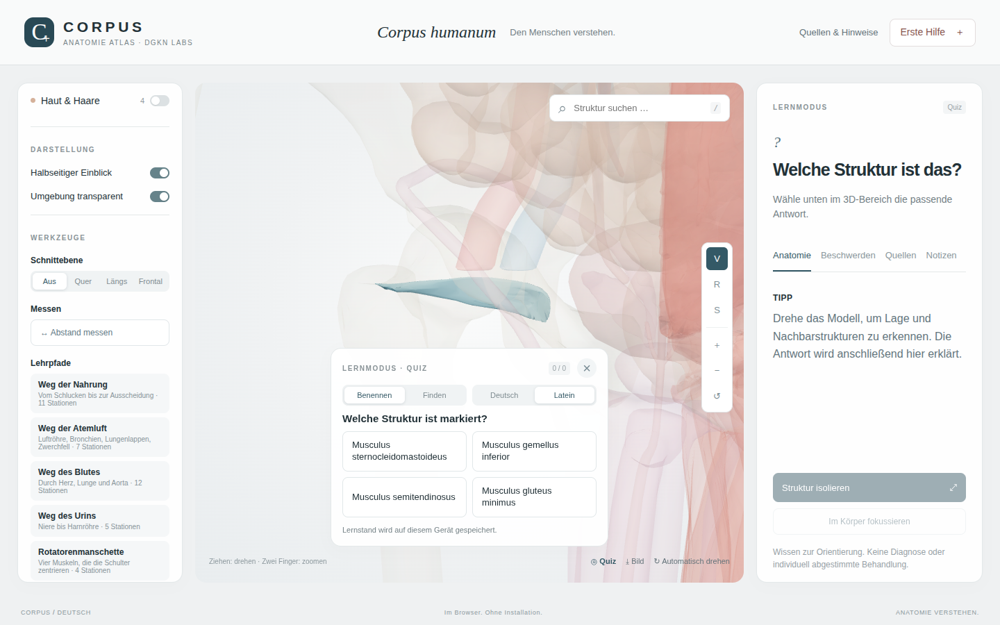<br><sub><b>Quiz auf Latein</b> – welche Struktur ist markiert?</sub></td>
<td>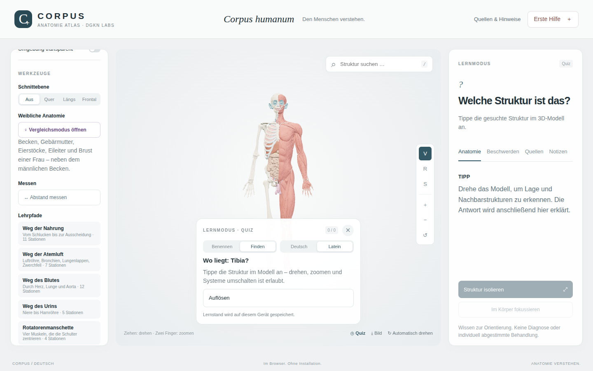<br><sub><b>Quiz „Finden“</b> – Struktur im Modell antippen</sub></td>
</tr>
<tr>
<td>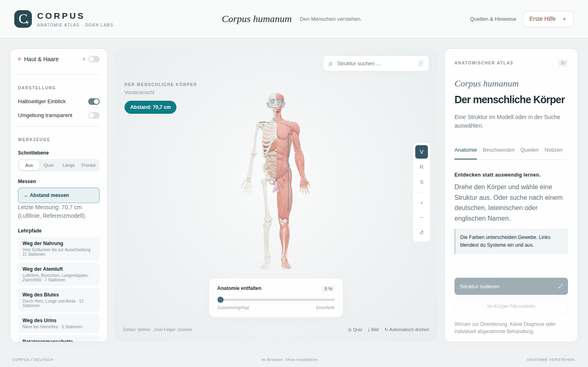<br><sub><b>Messen</b> – Abstand in Zentimetern</sub></td>
<td>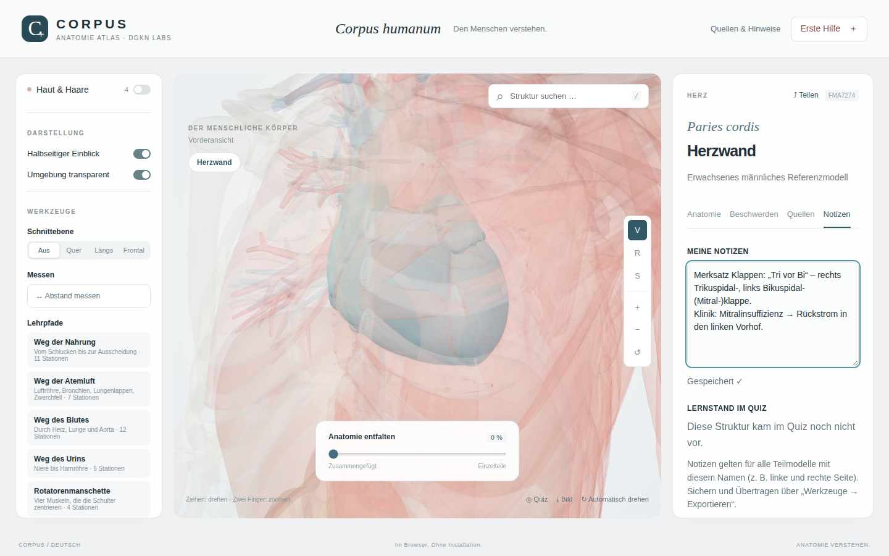<br><sub><b>Notizen</b> – Merksätze und Lernstand je Struktur</sub></td>
</tr>
<tr>
<td>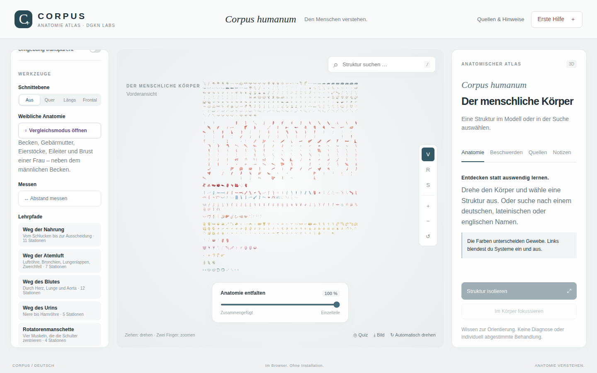<br><sub><b>Anatomie entfalten</b> – nach Körpersystem gruppiert</sub></td>
<td align="center">
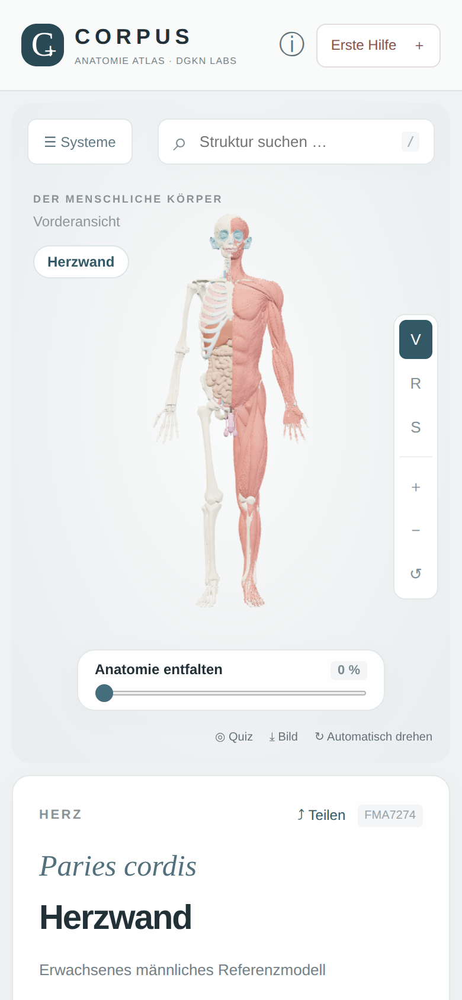
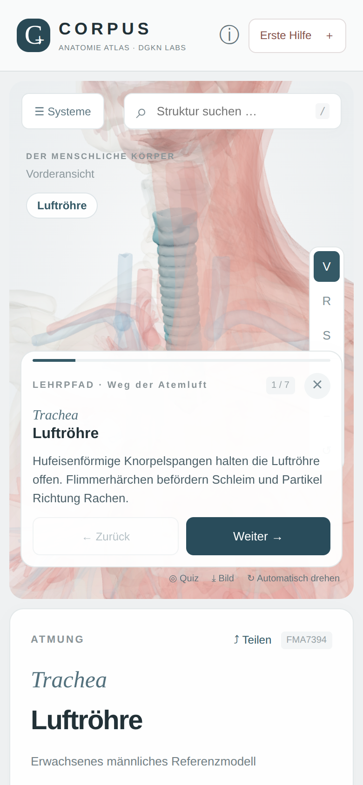<br><sub><b>Mobil</b> – voll bedienbar per Touch</sub></td>
</tr>
</table>

---

## 🚀 Schnellstart

Du brauchst nur **Python 3**, sonst nichts.

```bash
git clone https://github.com/dogenc/CORPUS-Anatomieatlas.git
cd CORPUS-Anatomieatlas
python3 start.py          # öffnet http://127.0.0.1:8765
```

```text
$ python3 start.py

 ██████╗  ██████╗  ██████╗  ██████╗  ██╗   ██╗ ███████╗
 ...
CORPUS: http://127.0.0.1:8765
Nur auf diesem Computer erreichbar. Beenden: Strg+C.
```

**Windows:** Doppelklick auf `START_WINDOWS.cmd`. Mehr dazu in [`START_HIER.txt`](START_HIER.txt).

> [!NOTE]
> `index.html` nicht direkt per Doppelklick öffnen – JavaScript-Module und 3D-Daten brauchen einen HTTP-Server.

---

## 🖥️ Desktop-Apps (Windows & macOS)

CORPUS gibt es auch als eigenständiges Programm, **komplett offline**, ohne Browser und ohne Python.

| System | Download |
|---|---|
| **Windows 10/11** | `…-Windows-Setup.exe` (Installation) oder `…-Windows-portable.exe` (ohne Installation) |
| **macOS** (Intel & Apple Silicon) | `…-macOS.dmg` |

➡️ **[Neueste Version unter „Releases“](../../releases/latest)**

> [!TIP]
> Die Apps sind nicht kostenpflichtig signiert. Beim ersten Start warnt das System:
> - **Windows:** „Der Computer wurde durch Windows geschützt“ → *Weitere Informationen* → *Trotzdem ausführen*
> - **macOS:** App in „Programme“ ziehen, dann *Rechtsklick → Öffnen* (bzw. *Systemeinstellungen → Datenschutz & Sicherheit → Dennoch öffnen*)

Gebaut wird mit [Electron](https://www.electronjs.org) aus dem Ordner [`desktop/`](desktop). Die Builds laufen automatisch über GitHub Actions ([`.github/workflows/desktop.yml`](.github/workflows/desktop.yml)), sobald ein Versions-Tag wie `v1.0.0` gepusht wird. Selbst bauen geht so:

```bash
cd desktop
npm ci
npm start            # testen
npm run dist:win     # auf Windows → desktop/release/*.exe
npm run dist:mac     # auf macOS   → desktop/release/*.dmg
```

---

## 🌍 Veröffentlichen

Der Ordner `dist` ist die fertige Website, ein Build-Schritt ist nicht nötig.

**Cloudflare Pages (empfohlen, kostenlos):**
1. [dash.cloudflare.com](https://dash.cloudflare.com) → **Workers & Pages** → **Create application** → Reiter **Pages** → **Import an existing Git repository**
2. GitHub verbinden und dieses Repository auswählen → **Begin setup**
3. **Framework preset:** *None* · **Build command:** leer lassen · **Build output directory:** `dist` · **Production branch:** `main`
4. **Save and Deploy** → nach etwa einer Minute ist CORPUS unter `https://<projektname>.pages.dev` erreichbar
5. Optional: **Custom domains** → eigene Domain eintragen · **Cloudflare Access** → Zugriff auf bestimmte E-Mail-Adressen beschränken

Jeder Push auf `main` wird danach automatisch veröffentlicht. Sicherheits-Header (Content-Security-Policy u. a.) und Caching sind in [`dist/_headers`](dist/_headers) festgelegt und werden von Cloudflare automatisch angewendet. Jeder andere statische Webserver funktioniert ebenso, solange `dist` die Wurzel ist. Für Offline-Modus und Teilen-Funktionen ist HTTPS nötig.

---

## 🗂️ Projektstruktur

```text
CORPUS-Anatomieatlas/
├── dist/                      ← Website (Wurzel beim Hosting)
│   ├── index.html             Oberfläche
│   ├── style.css              Gestaltung
│   ├── app.js                 3D-Ansicht, Auswahl, Suche, Quiz, Teilen, Bildexport
│   ├── pro.js                 Schnittebenen, Messen, Lehrpfade, Notizen, Ansicht-Links
│   ├── names.js               deutsche & lateinische Bezeichnungen
│   ├── knowledge.js           Erklärtexte, Beschwerde-Hinweise, Quellen
│   ├── sw.js                  Service Worker (Offline)
│   ├── manifest.webmanifest   Web-App-Manifest
│   ├── vendor/                Three.js 0.180.0 (MIT), lokal mitgeliefert
│   └── assets/                catalog.json + 11 gepackte 3D-Pakete (gzip)
├── desktop/                   Electron-Hülle für Windows/macOS (main.js, package.json, Icon)
├── .github/workflows/         automatischer Desktop-Build & Release
├── scripts/prepare_meshes.py  OBJ → Binärpakete
├── docs/                      Banner & Screenshots
├── LICENSE · NOTICE.md · RECHTLICHES.md   Lizenz, Drittkomponenten, Haftung & Datenschutz
└── start.py · START_WINDOWS.cmd · START_HIER.txt
```

**Technik:** Vanilla JavaScript (ES-Module) und Three.js, kein Framework, kein Bundler.<br>
**Browser:** WebGL2, Importmaps und `DecompressionStream`, also jeder aktuelle Chrome, Edge, Firefox oder Safari.

---

## 🤝 Mitmachen

Beiträge sind willkommen – besonders aus Medizin und Biologie:

- 🩻 **Fachliche Prüfung** der Erklärtexte, Übersetzungen und Lehrpfade (`dist/knowledge.js`, `dist/names.js`, `dist/pro.js`)
- 🧭 **Neue Lehrpfade**: Ein Pfad ist nur eine Liste aus englischem Strukturnamen und Text, siehe `TOURS` in `dist/pro.js`
- 📚 **Mehr Detailtexte**: Derzeit haben 268 von 934 Modellen eine eigene Beschreibung
- 🌐 **Weitere Sprachen** und Barrierefreiheit

Am einfachsten: Issue öffnen oder Pull Request stellen. Bitte medizinische Inhalte immer mit Quelle belegen. Mit einem Beitrag erklärst du dich einverstanden, dass er unter der [MIT-Lizenz](LICENSE) veröffentlicht wird. Inhalte von Dritten nur übernehmen, wenn ihre Lizenz das erlaubt.

---

## 📜 Lizenz

CORPUS ist **Open Source**. Es gelten drei Lizenzen nebeneinander:

| Bestandteil | Herkunft | Lizenz |
|---|---|---|
| **Code & eigene Texte** | CORPUS (dieses Repository) | [**MIT**](LICENSE) – frei nutzbar, auch kommerziell. Copyright- und Lizenzhinweis müssen erhalten bleiben. |
| 3D-Modelle | [BodyParts3D 3.0](https://dbarchive.biosciencedbc.jp/data/bodyparts3d/20110915/README_e.html), © The Database Center for Life Science | [CC BY-SA 2.1 Japan](https://creativecommons.org/licenses/by-sa/2.1/jp/), siehe [`dist/assets/LICENSE.txt`](dist/assets/LICENSE.txt) |
| 3D-Bibliothek | [Three.js](https://threejs.org) 0.180.0 | MIT, siehe [`dist/vendor/LICENSE`](dist/vendor/LICENSE) |

Die MIT-Lizenz gilt **nicht** für die 3D-Daten. Wer sie weitergibt, muss BodyParts3D nennen und Bearbeitungen wieder unter CC BY-SA veröffentlichen. Alle Einzelheiten zu Drittkomponenten und Textquellen stehen in [**NOTICE.md**](NOTICE.md).

Die Erklärtexte sind eigene Zusammenfassungen auf Grundlage von OpenStax *Anatomy and Physiology 2e* (CC BY 4.0), gesund.bund.de, IQWiG, DRK und NHS. Die Quelle ist bei jedem Eintrag verlinkt.

Änderungen an den 3D-Daten: Koordinatentransformation, Vertex-Clustering (0,8–1,35 mm), binäres Packen, gzip, Einfärbung. `scripts/prepare_meshes.py` erzeugt die Pakete reproduzierbar aus den Original-OBJ-Dateien (`python3 scripts/prepare_meshes.py <quellordner>`, benötigt NumPy).

## ⚠️ Hinweise & Grenzen

> [!IMPORTANT]
> **Kein Medizinprodukt.** CORPUS ist ausschließlich für Bildungszwecke bestimmt. Zweckbestimmung, Haftungsausschluss und Datenschutz stehen in [**RECHTLICHES.md**](RECHTLICHES.md).

- Männliches erwachsenes Referenzmodell, keine vollständige Anatomie und kein individueller Körperscan. 934 Teilmodelle sind nicht 934 Organe.
- Der größte Teil der Anatomie ist bei Frauen und Männern gleich. Wo sich beide unterscheiden (Becken, Harnröhre, Geschlechtsorgane, Kehlkopf, Beckenboden, Brust), erklärt die App das im Kasten **„Frau & Mann“** und im gleichnamigen Lehrpfad. Weibliche Geschlechtsorgane sind als 3D-Modell bisher nicht enthalten.
- Messwerte stammen aus einem einzelnen Referenzmodell und sind **Näherungen**.
- Texte, Übersetzungen und Lehrpfade sind KI-unterstützt erstellt und **nicht ärztlich abgenommen**.
- **Datenschutz:** keine Cookies, kein Tracking. Notizen und Lernstand bleiben lokal im Browser.
- **CORPUS dient dem Lernen und der Orientierung. Es stellt keine Diagnose und ersetzt keine ärztliche Untersuchung.** Bei Lebensgefahr: **112**.

<div align="center">
<br>


<sub>Mit ❤️ für alle, die den menschlichen Körper verstehen wollen.</sub>
</div>
